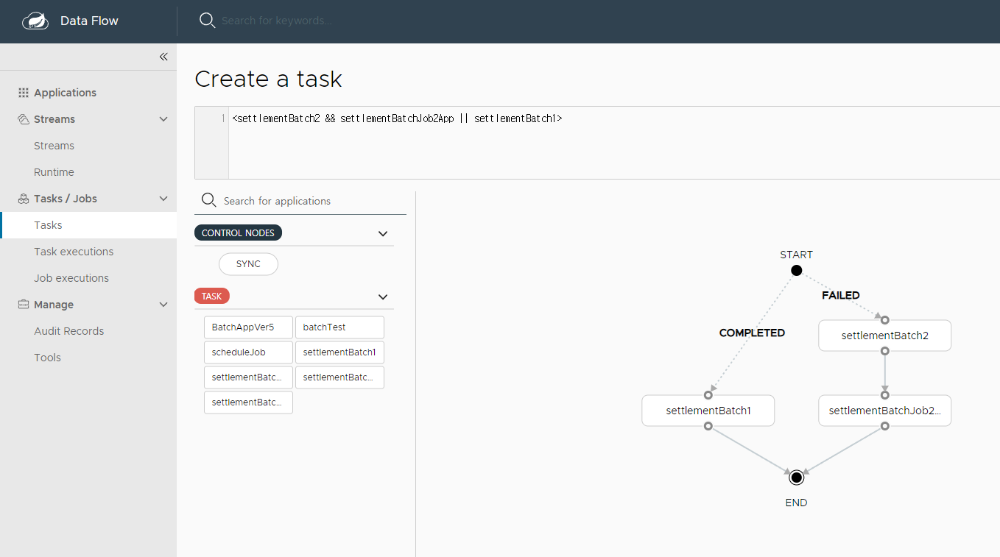
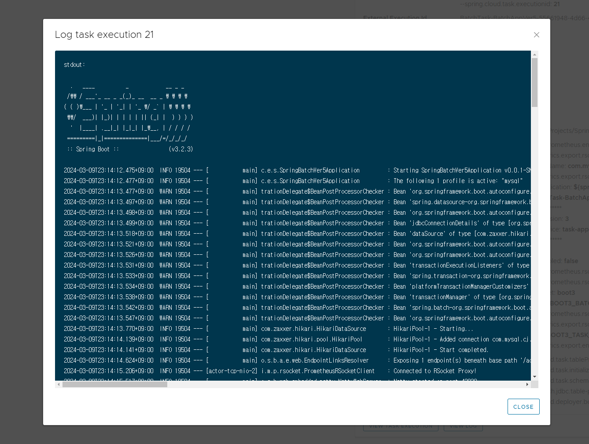
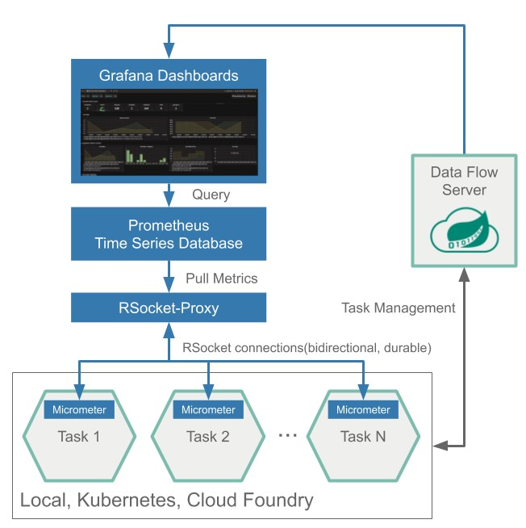
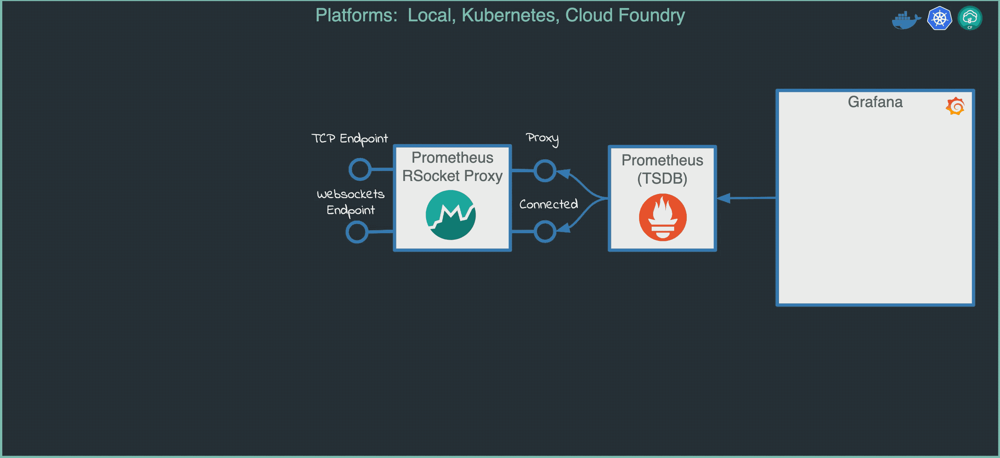
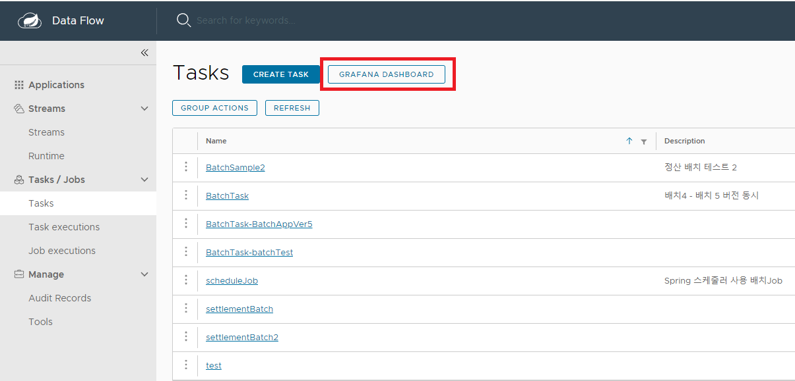
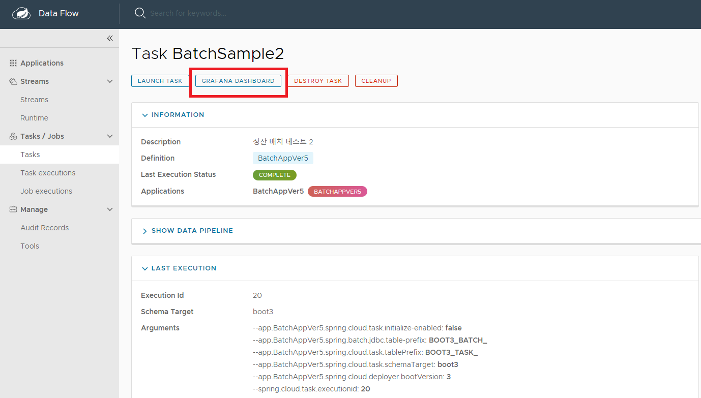
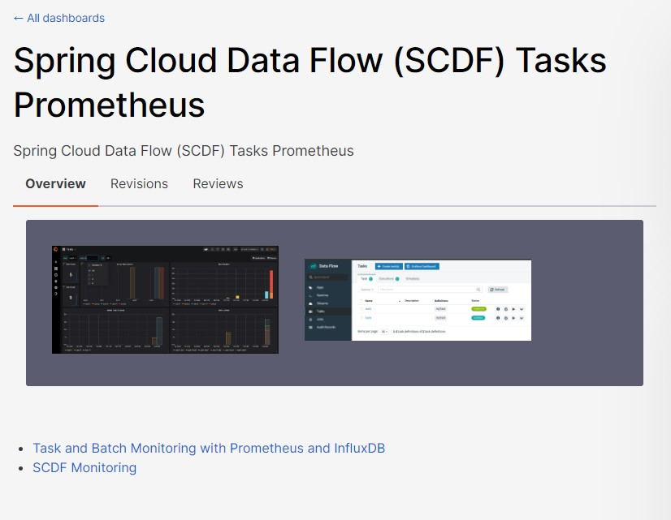
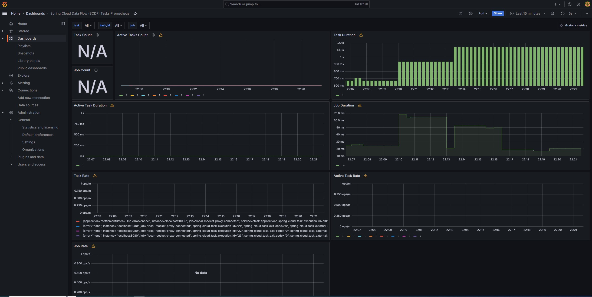
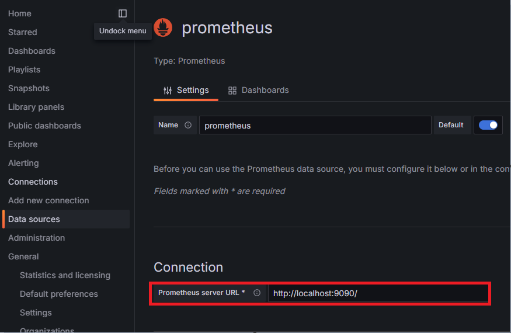

# SCDF

> Spring Cloud Data Flow 와 그라파나를 활용한 배치 모니터링

## SCDF 기능 소개

### TASK 등록 ( Batch Application )

 - 개발 완료된 Batch Application 을 Task 단위로 배포 가능하다


### FLOW 처리

 - TASK 로 등록된 Job 들간의 Exit Status 값에 따라 TASK FLOW 를 지정해 줄 수 있다




### List


### 상세 정보


### Log

 - Job 별 상세 페이지 내에서 Log 확인이 가능하여, 별도 서버접근 없이 모니터링이 가능




---

# 모니터링

## Prometheus & Grafana

> SCDF Stream 및 Task 모니터링을 위한 Prometheus를 통한 Grafana 연동을 지원한다<p>
> 아래 그림처럼 RSocket-Proxy Server - Prometheus 를 통해 metric 정보들을 수집하고 있음.




> SCDF 에서 전체 & 특정 Task에 대한 그라파나 링크 지원 ( 기능 활성화 필요 )





> 그라파나 공유 대시보드의 이미 공개된 대시보드를 활용하여 빠르게 화면을 구성할 수 있다





## Setting

### SCDF 설정

```yaml
spring:
  cloud:
    dataflow:
      metrics:
        dashboard:
          url: localhost:3000 #그라파나 url
management:
  metrics:
    export:
      prometheus:
        enabled: true
        rsocket:
          enabled: true
          host: localhost # RSocket Proxy
          port: 7001
```

### Batch App 설정

```groovy
    implementation 'org.springframework.cloud:spring-cloud-starter-task:3.0.4'
    implementation 'io.micrometer.prometheus:prometheus-rsocket-spring:1.5.0'
```
### Prometheus 설정

 - `prometheus.yml` 설정
```groovy
  - job_name: 'local-rsocket-proxy-connected'

    scrape_interval: 10s
    scrape_timeout: 9s
    metrics_path: '/metrics/connected'
    static_configs:
      - targets: ['localhost:8080']

  - job_name: 'local-rsocket-proxy'

    scrape_interval: 10s
    scrape_timeout: 2s
    metrics_path: '/metrics/proxy'
    static_configs:
      - targets: ['localhost:8080']
```

### Grafana

 - Prometheus Server URL 설정

